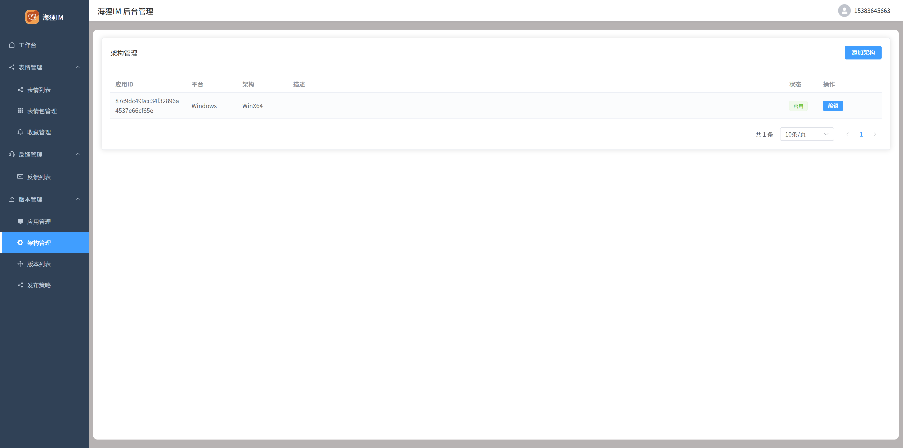
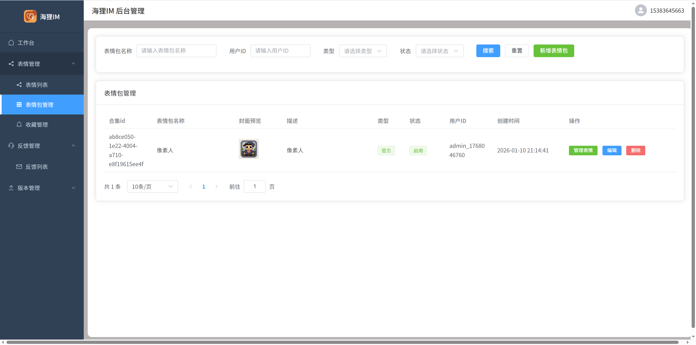
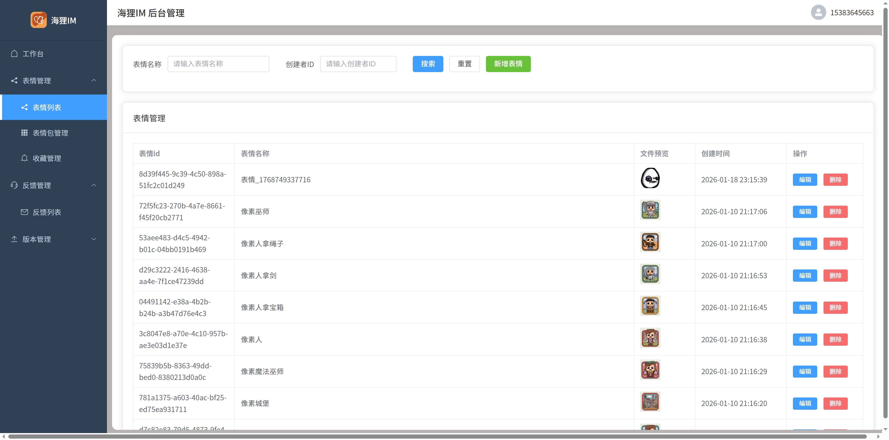

# 🦫 Beaver Manager - 海狸IM后台管理系统

[](LICENSE)
[](https://vuejs.org/)
[](https://element-plus.org/)
[](https://www.typescriptlang.org/)
[](https://qm.qq.com/q/82rbf7QBzO)

> 🚀 **现代化后台管理系统** - 基于 Vue 3 + Element Plus + TypeScript 构建，为海狸IM提供全面的管理和监控功能

[English](README_EN.md) | [中文](README.md)

---

## ✨ 核心特性

- 👥 **用户管理** - 用户信息管理、权限控制、账号状态管理
- 💬 **聊天管理** - 聊天记录查看、内容审核、敏感词过滤
- 👨‍👩‍👧‍👦 **群组管理** - 群组创建审核、成员管理、群设置配置
- 😀 **表情包管理** - 表情包审核、分类管理、版本控制
- 🔄 **版本管理** - 应用更新发布、版本控制、灰度发布
- 📊 **数据统计** - 用户活跃度分析、消息量统计、系统监控
- 🔧 **系统设置** - 参数配置、功能开关、权限角色管理
- 🎨 **现代化UI** - 基于 Element Plus 的美观界面设计

## 🛠️ 技术栈

| 技术 | 版本 | 说明 |
|------|------|------|
| **Vue.js** | 3.5+ | 渐进式前端框架 |
| **TypeScript** | 5.8+ | 类型安全 |
| **Element Plus** | 2.10+ | Vue 3 组件库 |
| **Vite** | 7.0+ | 下一代前端构建工具 |
| **Pinia** | 3.0+ | Vue 状态管理 |
| **Vue Router** | 4.5+ | 官方路由管理器 |
| **Axios** | 1.10+ | HTTP 客户端 |

## 📊 功能展示

### 🔄 版本管理
<div align="center">
  
  
  
</div>

### 😀 表情包管理
<div align="center">
  
  
  
</div>

## 🚀 快速开始

### 环境要求
- Node.js >= 18.0.0

### 安装步骤
```bash
# 克隆项目
git clone https://github.com/wsrh8888/beaver-manager.git
cd beaver-manager

# 安装依赖
npm install

# 启动开发服务器
npm run dev

# 构建生产版本
npm run build_prod

# 测试环境构建
npm run build_test
```

### 环境配置
1. 创建 `.env.development` 文件（开发环境）
2. 创建 `.env.test` 文件（测试环境）
3. 创建 `.env.production` 文件（生产环境）

详细配置请参考[环境配置文档](https://wsrh8888.github.io/beaver-docs/manager/config)。

## 🔗 相关项目

| 项目 | 仓库地址 | 说明 |
|------|----------|------|
| **beaver-server** | [GitHub](https://github.com/wsrh8888/beaver-server) \| [Gitee](https://gitee.com/dawwdadfrf/beaver-server) | 后端服务 |
| **beaver-mobile** | [GitHub](https://github.com/wsrh8888/beaver-mobile) \| [Gitee](https://gitee.com/dawwdadfrf/beaver-mobile) | 移动端应用 |
| **beaver-desktop** | [GitHub](https://github.com/wsrh8888/beaver-desktop) \| [Gitee](https://gitee.com/dawwdadfrf/beaver-desktop) | 桌面端应用 |
| **beaver-manager** | [GitHub](https://github.com/wsrh8888/beaver-manager) | 后台管理系统 |

## 📚 文档与帮助

- 📖 **详细文档**: [Beaver IM 文档](https://wsrh8888.github.io/beaver-docs/)
- 🎥 **视频教程**: [B站教程](https://www.bilibili.com/video/BV1HrrKYeEB4/)
- 📱 **移动端体验包**: [Android体验包](https://github.com/wsrh8888/beaver-docs/releases/download/lastest/latest.apk)
- 💬 **QQ群**: [1013328597](https://qm.qq.com/q/82rbf7QBzO)

## 🤝 贡献指南

我们欢迎所有形式的贡献！

1. Fork 本仓库
2. 创建特性分支 (`git checkout -b feature/AmazingFeature`)
3. 提交更改 (`git commit -m 'Add some AmazingFeature'`)
4. 推送到分支 (`git push origin feature/AmazingFeature`)
5. 开启 Pull Request

## ⭐ 支持项目

如果这个项目对你有帮助，请给我们一个 ⭐ Star！

## ☕ 请作者喝杯茶

如果这个项目对你有帮助，欢迎请作者喝杯茶 ☕

<div align="center">
  
  
</div>

## 📄 开源协议

本项目基于 [MIT](LICENSE) 协议开源。

## ⭐ Star历史

[](https://star-history.com/#wsrh8888/beaver-manager&Date)

---

<div align="center">
  <strong>Made with ❤️ by Beaver IM Team</strong><br>
  <em>企业级即时通讯平台后台管理系统</em>
</div>