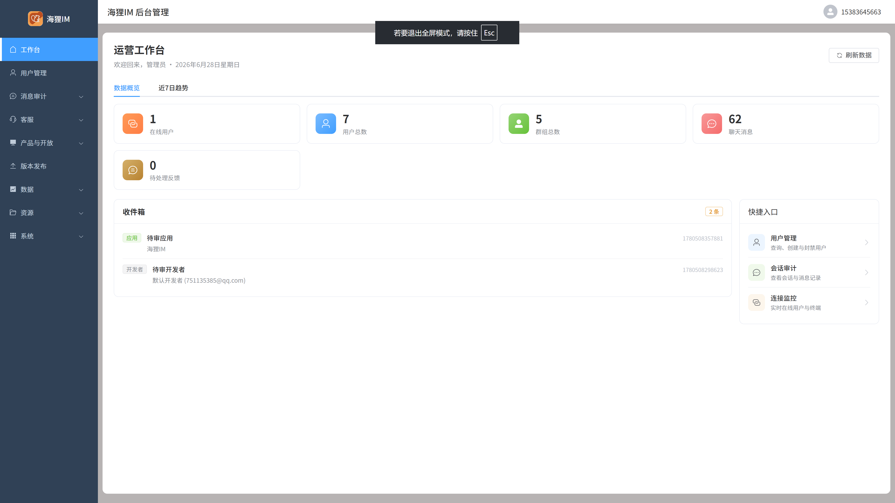
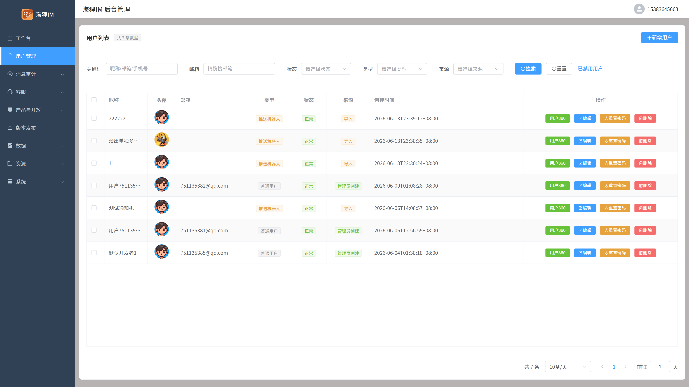
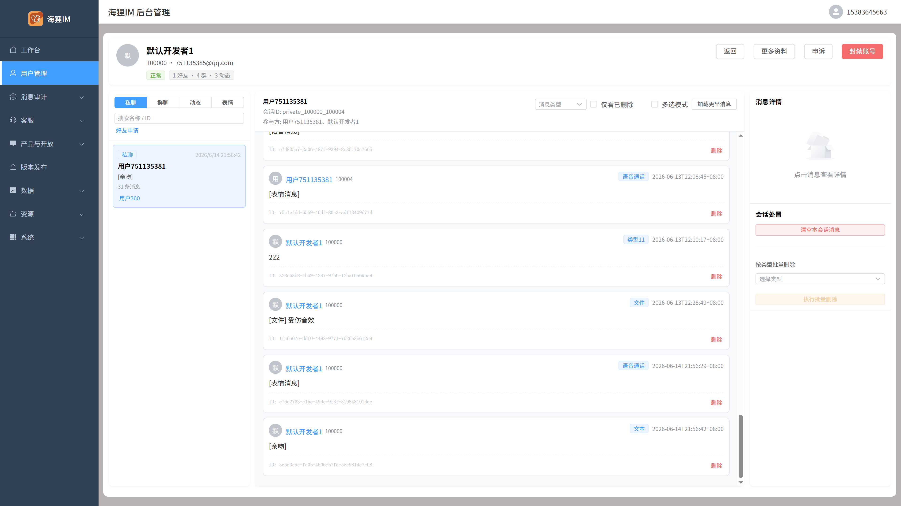
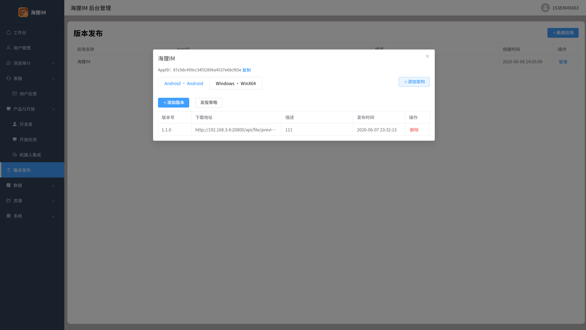
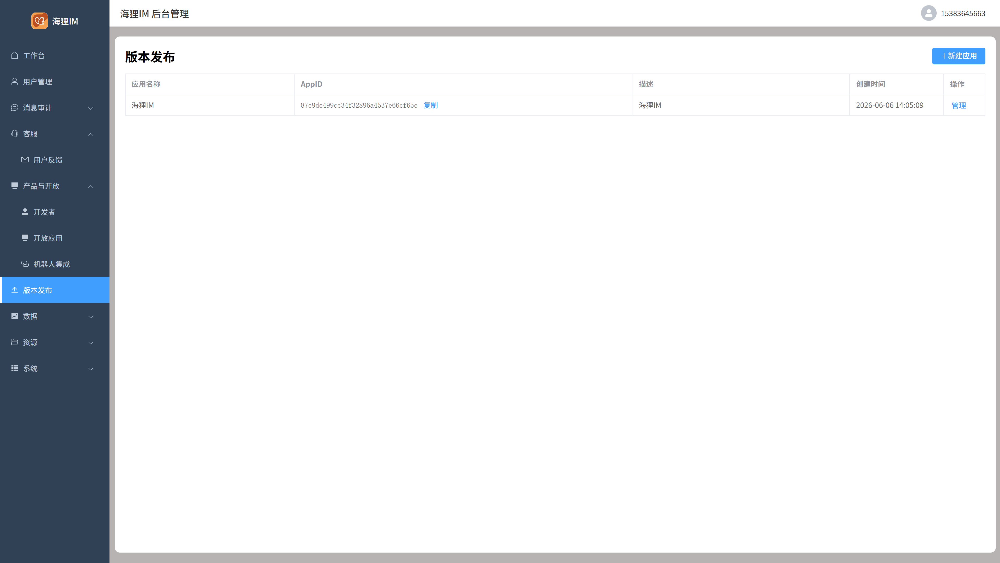
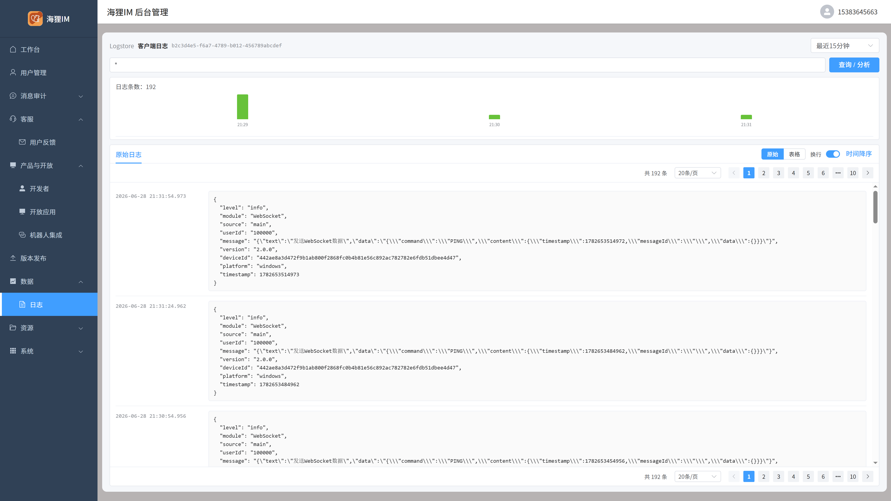
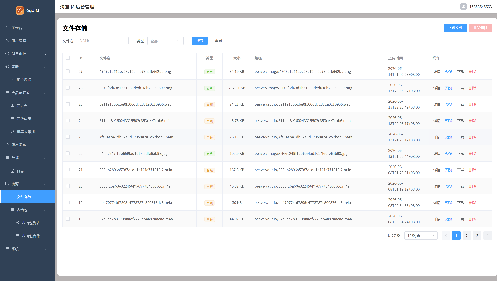
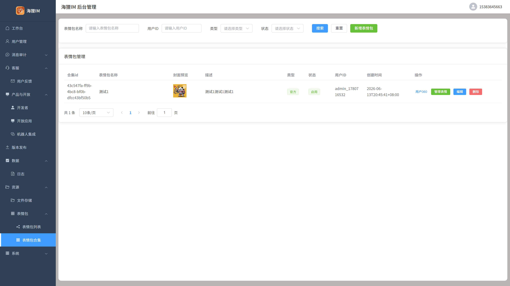
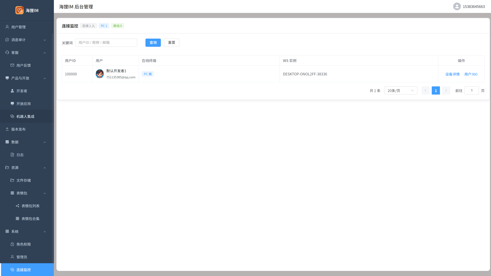

# 🦫 Beaver Manager - 海狸IM后台管理系统

> **海狸 IM 的后台管理 Web 端** - 基于 Vue 3 + Element Plus + TypeScript 开发，对接 beaver-server 管理接口，供运营与管理员进行用户管理、消息审计、版本发布与系统运维

**当前版本：[2.0.1](VERSION)**（以仓库根目录 [`VERSION`](VERSION) 文件为准）

[English](README_EN.md) | [中文](README.md)

---

## ✨ 核心特性

- 📊 **运营工作台** - 数据概览、待办收件箱、近 7 日趋势与快捷入口
- 👥 **用户管理** - 用户检索与状态管理、用户 360 视图（资料 / 会话 / 群聊审计）
- 🔍 **消息审计** - 消息检索、会话审计，支持合规排查与消息处置
- 💬 **客服反馈** - 用户意见与问题受理
- 🧩 **产品与开放** - 开发者审核、开放应用、机器人 / Webhook 集成
- 🔄 **版本发布** - 应用管理、架构配置、安装包与发布策略
- 📋 **客户端日志** - 按 Logstore 查询客户端上报日志，支持时间范围与检索
- 📦 **资源管理** - 文件存储、表情包与表情素材
- ⚙️ **系统管理** - 角色权限、管理员、WebSocket 连接监控

## 🛠️ 技术栈

- **Vue 3** + **Vite** + **TypeScript** - 前端渲染与工程化
- **Element Plus** - UI 组件库
- **Pinia** + **Vue Router** - 状态管理与路由（Hash 模式）
- **Axios** - 对接 beaver-server 管理端 API

## 📱 功能展示

### 📊 运营工作台

  

### 👥 用户管理

  
  

### 🔄 版本发布

  
  

### 📋 客户端日志

  

### 📦 资源管理

  
  

### 🧩 产品与开放

  

### ⚙️ 系统管理

  

## 🔗 相关项目

| 项目 | 仓库地址 | 说明 |
|------|----------|------|
| **beaver-server** | [GitHub](https://github.com/wsrh8888/beaver-server) \| [Gitee](https://gitee.com/dawwdadfrf/beaver-server) | 后端服务 |
| **beaver-flutter** | [GitHub](https://github.com/wsrh8888/beaver-flutter) \| [Gitee](https://gitee.com/dawwdadfrf/beaver-flutter) | 移动端应用 (Flutter - 推荐) |
| **beaver-desktop** | [GitHub](https://github.com/wsrh8888/beaver-desktop) \| [Gitee](https://gitee.com/dawwdadfrf/beaver-desktop) | 桌面端应用 |
| **beaver-manager** | [GitHub](https://github.com/wsrh8888/beaver-manager) \| [Gitee](https://gitee.com/dawwdadfrf/beaver-manager) | 后台管理系统 |
| **beaver-open** | [GitHub](https://github.com/wsrh8888/beaver-open) \| [Gitee](https://gitee.com/dawwdadfrf/beaver-open) | 开放平台 |
| **beaver-oauth** | [GitHub](https://github.com/wsrh8888/beaver-oauth) \| [Gitee](https://gitee.com/dawwdadfrf/beaver-oauth) | OAuth 授权登录 |

## 📚 文档与帮助

- 📖 **详细文档**: [Beaver IM 文档](https://wsrh8888.github.io/beaver-docs/manager/)
- 🎥 **视频教程**: [B站教程](https://www.bilibili.com/video/BV1HrrKYeEB4/)
- 💬 **QQ群**:
  - [1013328597](https://qm.qq.com/q/82rbf7QBzO) - 群一
  - [1044762885](https://qm.qq.com/q/82rbf7QBzO) - 群二
  - [1003121259](https://qm.qq.com/q/82rbf7QBzO) - 群三

## ⭐ 支持项目

如果这个项目对你有帮助，请给我们一个 ⭐ Star！

## ☕ 请作者喝杯茶

如果这个项目对你有帮助，欢迎请作者喝杯茶 ☕

  
  

## 📄 开源协议与免责声明

本项目基于 [MIT](LICENSE) 协议开源 - 详情请参阅 [LICENSE](LICENSE) 文件。

### ⚖️ 使用说明

**项目定位**：本项目主要用于**技术学习和交流**，希望为开发者提供一个学习和研究的平台。

**使用建议**：
- 📚 **学习交流** - 欢迎用于个人学习、技术研究、学术交流
- 🤝 **开源贡献** - 欢迎提交代码改进、Bug修复、功能建议
- 🔒 **合规使用** - 请确保使用方式符合当地法律法规
- 💡 **创新应用** - 鼓励基于本项目进行创新性应用开发

**温馨提示**：
- 本项目采用 MIT 开源协议，您可以自由使用、修改和分发
- 建议在使用前仔细阅读相关法律法规，确保合规使用
- 如有疑问或需要帮助，欢迎通过 QQ 群或 GitHub Issues 交流

### 📋 项目来源标注要求

**重要**：如果您基于本项目进行二次开发或发布，**必须**在项目中保留以下信息：

#### 🖥️ **前端项目（移动端/桌面端/Web应用）**
- **关于页面**：必须在"关于我们"、"关于应用"或类似页面中包含项目来源标注
- **必需文本**："基于 [Beaver IM](https://github.com/wsrh8888/beaver-server) 开源IM项目开发"
- **链接**：必须提供可点击的原始项目链接

#### 🔧 **后端项目（服务器/API服务）**
- **README.md**：必须在项目介绍或描述中包含来源标注
- **必需文本**："基于 [Beaver IM](https://github.com/wsrh8888/beaver-server) 开源IM项目开发"
- **链接**：必须提供可点击的原始项目链接

#### 📄 **通用要求**
- **LICENSE 文件**：保留原项目 MIT 协议信息
- **商业使用**：公司或企业级商业应用必须事先获得明确授权

> 💡 **友好提醒**：本项目支持个人学习和个人商业使用。如果是公司或企业级商业应用，**必须事先获得我们的明确授权**，否则不得用于商业目的。

> 📖 **详细法律条款**：请参阅 [LEGAL.md](LEGAL.md) 文件了解完整的法律免责声明和使用要求。

## ⭐ Star历史

